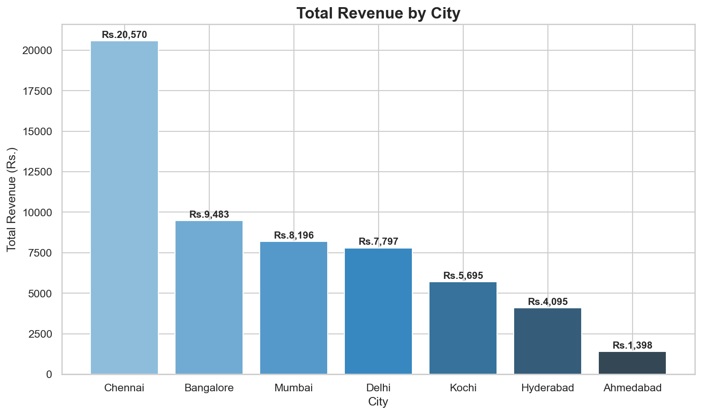
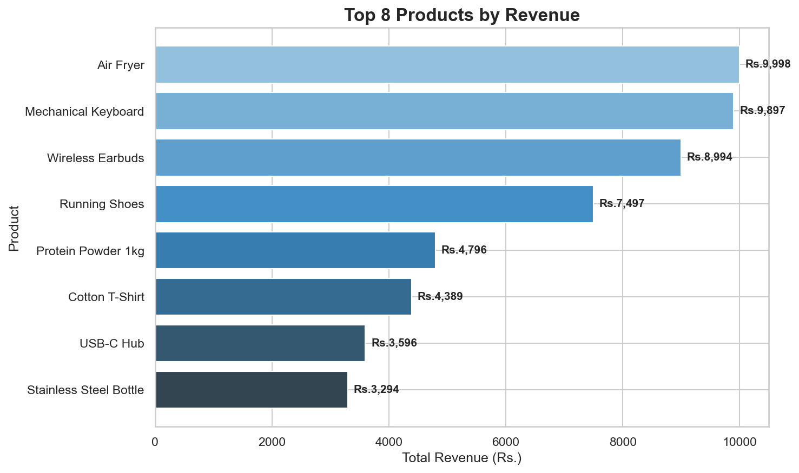
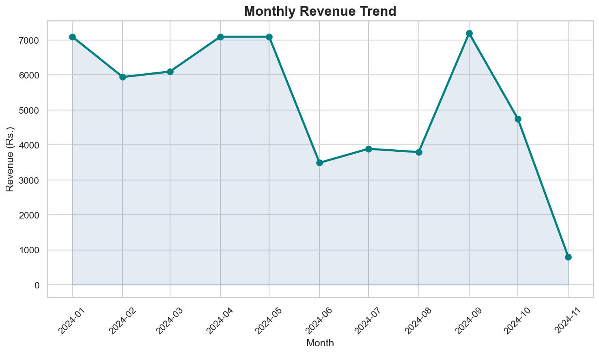
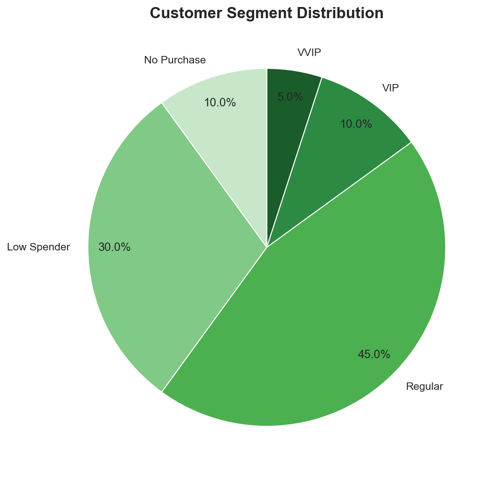
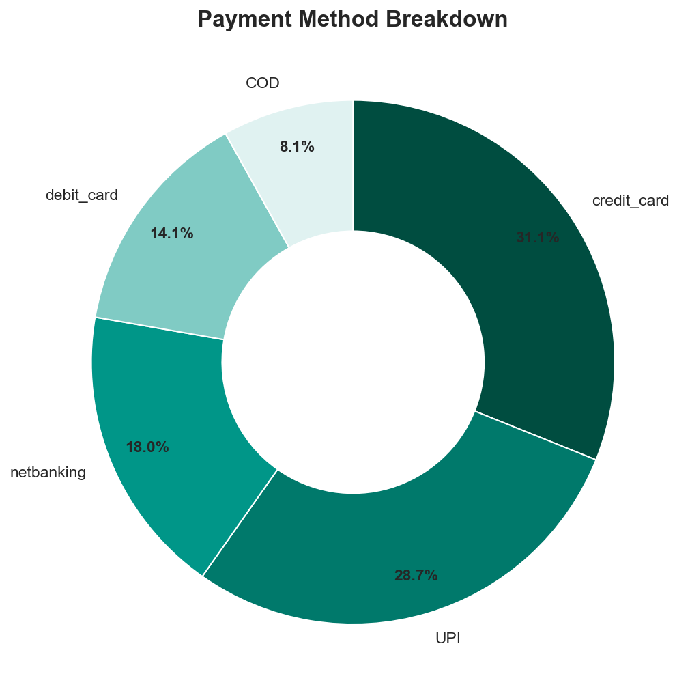
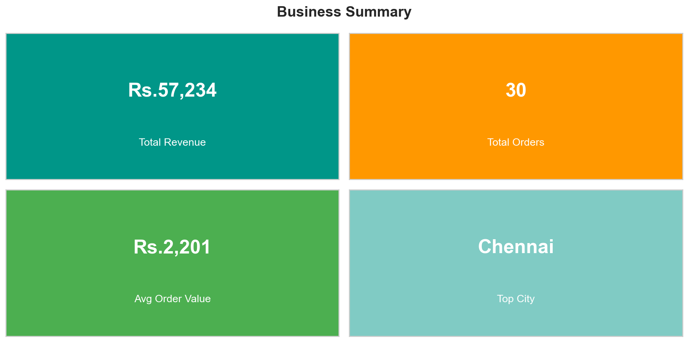

# E-Commerce Sales Analysis

End-to-end data analysis project on an Indian e-commerce database using PostgreSQL, Python and Jupyter Notebook.

## Tools Used
- PostgreSQL 18 — database and SQL queries
- Python (Pandas, Matplotlib, Seaborn) — data analysis and visualization
- Jupyter Notebook — interactive analysis environment
- GitHub — version control and portfolio

## Database Structure
5 tables with proper relationships:

| Table | Description | Rows |
|-------|-------------|------|
| customers | Customer details across Indian cities | 20 |
| products | Product catalogue across 6 categories | 15 |
| orders | Order records with status tracking | 30 |
| order_items | Line items linking orders to products | 45 |
| payments | Payment records by method | 26 |

## Business Questions Answered
1. Which city generates the most revenue?
2. What are the top products by revenue?
3. How is monthly revenue trending?
4. What is the customer segment breakdown?
5. Which payment method is most popular?

## Key Findings
- Chennai is the top revenue city with Rs.20,570
- Air Fryer is the highest revenue product at Rs.9,998
- Credit card leads payment methods at 31.1%
- 45% of customers are regular spenders — opportunity for upselling
- Total revenue of Rs.57,234 across 30 orders

## Dashboard Preview

## How to Run
1. Install PostgreSQL and create a database
2. Run `ecommerce_sql_project.sql` to create tables and load data
3. Install dependencies: `pip install pandas matplotlib seaborn sqlalchemy psycopg2-binary`
4. Open `ecommerce_analysis.ipynb` in Jupyter Notebook
5. Update the database connection password in Cell 3
6. Run all cells
